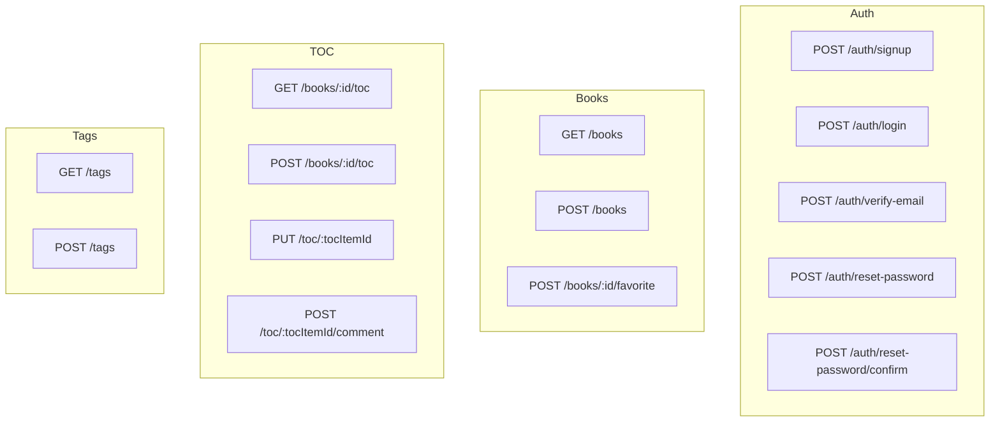

```mermaid
flowchart TB
    subgraph Auth
        A1[POST /auth/signup]
        A2[POST /auth/login]
        A3[POST /auth/verify-email]
        A4[POST /auth/reset-password]
        A5[POST /auth/reset-password/confirm]
    end
    subgraph Books
        B1[GET /books]
        B2[POST /books]
        B3[POST /books/:id/favorite]
    end
    subgraph TOC
        T1[GET /books/:id/toc]
        T2[POST /books/:id/toc]
        T3[PUT /toc/:tocItemId]
        T4[POST /toc/:tocItemId/comment]
    end
    subgraph Tags
        G1[GET /tags]
        G2[POST /tags]
    end
```
